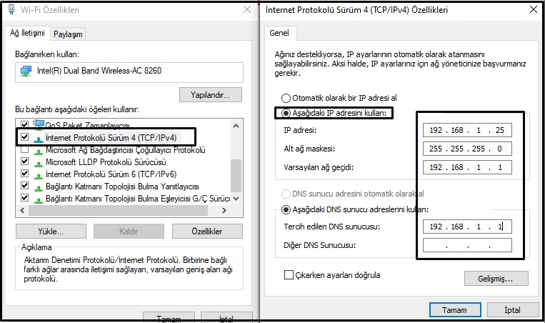

# IP (Internet Protocol)

IP, "Internet Protocol" (İnternet Protokolü) ifadesinin kısaltmasıdır ve internet üzerinde veri alışverişi yapabilmek için kullanılan temel kurallar ve standartları tanımlar. Bu protokol, bilgisayarlar ve diğer cihazların birbirleriyle nasıl "konuşacaklarını" ve veri paketlerinin bir noktadan diğerine nasıl geçeceğini belirler.

 Her cihazın, internet üzerindeki diğer cihazlar tarafından tanınabilmesi için benzersiz bir IP adresi vardır. Bu adresler, cihazların birbirlerini bulmalarına ve veri alışverişinde bulunmalarına olanak tanır. Örneğin, 192.168.1.1 gibi.

 belirli IP adres aralıkları "özel" olarak ayrılmıştır ve bu adresler genellikle özel ağlarda kullanılır, yani bu IP'ler internet üzerinde benzersiz değildir ve doğrudan internete yönlendirilemez. Ayrıca, belirli adresler ve aralıklar "atanamaz" olarak belirlenmiştir çünkü bu IP'ler belirli amaçlar için ayrılmıştır. İşte bu kategorilere giren IP adresleri:

**Bir hikaye ile ip adresini anlatacak olursak:**

Bir zamanlar, büyülü bir şehirde, "VeriVadi" adında bir şirket vardı. VeriVadi, dünyanın dört bir yanındaki insanlara değerli bilgiler sunan büyük bir kütüphane gibiydi. Ancak bu bilgileri almak için, her çalışanın özel bir kimlik kartına ihtiyacı vardı - bu, onların IP adresiydi.

Bir gün, Ali, VeriVadi'nin en çalışkan elemanlarından biri, önemli bir mesajı iletmek için Gmail'e giriş yapmaya çalıştı. Ancak bilgisayarına büyülü kimlik kartını (IP adresini) almayı unuttuğu için, Gmail'in kapıları ona kapalı kaldı. Bilgisayarı, Gmail'in büyük kapılarına vardığında, kapıdaki muhafızlar (ağ sunucuları), Ali'nin kimlik kartını (IP adresini) sordular. Fakat Ali'nin bilgisayarı boş bakışlarla muhafızlara baktı çünkü onun bir kimlik kartı yoktu!

Bu durumda, Ali hemen IT Büyücüsü Ayşe'ye koştu. Ayşe, VeriVadi'nin ağ büyücüleri arasında en bilgili olanıydı ve tüm büyülü kimlik kartlarını (IP adreslerini) dağıtan o muydu. Ayşe, Ali'nin bilgisayarına yeni bir büyülü kimlik kartı verdi ve bu sefer, bilgisayar Gmail'in kapılarına vardığında, muhafızlar onu hemen tanıdılar ve içeriye girmesine izin verdiler.

Ali, büyülü kimlik kartının (IP adresinin) önemini anladı. Bu özel kart olmadan, VeriVadi'nin büyülü kütüphanesindeki bilgilere veya diğer krallıkların (web sitelerinin) kapılarına erişemezdi. Bu kart, onun benzersiz kimliğiydi ve VeriVadi'nin muhafızları (ağ yönlendiricileri) onu doğru yerlere yönlendirmek için bu kimliği kullanıyordu.

Böylece, Ali her gün işe giderken büyülü kimlik kartını (IP adresini) almayı asla unutmadı ve VeriVadi'nin değerli bilgilerini dünyanın dört bir yanındaki insanlarla paylaşmaya devam etti.

**Özel IP Adres Aralıkları:**

**10.0.0.0 - 10.255.255.255 (10.0.0.0/8)**: Bu aralık, özel ağlarda kullanılmak üzere yaklaşık 16.7 milyon adres içerir.
**172.16.0.0 - 172.31.255.255 (172.16.0.0/12)**: Bu aralık, özel ağlar için yaklaşık 1 milyon adres içerir. 
**192.168.0.0 - 192.168.255.255 (192.168.0.0/16)**: Bu aralık, özel ağlar için yaklaşık 65 bin adres içerir.

**IP adresleri genellikle iki ana kategoriye ayrılır: yerel (private) ve genel (public).**

**Yerel IP Adresleri (Private IP Addresses (Local Network)):**

Bu IP adresleri, yerel ağ içinde benzersizdir, yani evinizdeki veya ofisinizdeki ağda.
Yerel IP'ler genellikle yönlendiriciniz (router) tarafından otomatik olarak atanan 192.168.xx.xx, 10.xx.xx.xx veya 172.16.xx.xx ile başlayan numaralardır.
Bu adresler internet üzerinde benzersiz değildir, yani dünya çapında birden çok yerel ağda aynı yerel IP adresleri olabilir.
Bu IP'ler, doğrudan internete bağlı olmadığından, internet üzerinden doğrudan erişilemez.

Aynı ağdaki Bu cihazlar birbirleriyle iletişim kurmak istediklerinde, hedef IP adresini (diğer cihazın yerel IP adresi) kullanarak ağ paketlerini doğrudan birbirlerine gönderebilirler. Bu, aynı ağ içinde oldukları için, bu paketlerin yönlendirici tarafından internete çıkarılmasına veya dış ağlara yönlendirilmesine gerek yoktur.

**Genel IP Adresleri (Public IP Addresses (Wide)):**

Bu IP adresleri, internet üzerinde benzersizdir ve doğrudan internete bağlı cihazlara atanır.
Ev veya ofisinizin genel IP adresi genellikle internet servis sağlayıcınız (ISP) tarafından sağlanır.
Bu IP adresi, dünya çapında erişilebilir, yani internete bağlı herhangi biri bu IP adresini kullanarak ağınıza erişmeye çalışabilir.

Yerel ip adresinizin Public bir ip adresine dönüştürülme işlemini **NAT (network address translation)** üstlenir buna ileride değineceğiz.

Bir örnek ile açıklamak gerekirse, evinizdeki bilgisayarın yerel IP adresi 192.168.1.5 olabilir, ancak internete bağlandığınızda, ISP'nizin atadığı genel IP adresini kullanırsınız. Bu genel IP, internet üzerindeki diğer tüm sistemler için sizin ağınızın "yüzü" olarak hizmet eder. Bu yüzden, bir e-postayı Gmail'e gönderirken, bu genel IP adresi kullanılarak internet üzerinden iletişim kurarsınız.

**Yönlendirilemeyen ve Atanamayan Adresler:**

**0.0.0.0**: Bu adres genellikle bir istemcinin kendi sistemi üzerinde belirli bir sunucu veya hizmeti belirtirken kullanılır, ancak gerçek bir hedef adresi olarak atanamaz. 
**127.0.0.0 - 127.255.255.255 (127.0.0.0/8)**: Bu adres aralığı yerel ana bilgisayar (localhost) için ayrılmıştır, genellikle test amaçlı olarak kullanılır ve ağ dışına yönlendirilemez. 
**169.254.0.0 - 169.254.255.255 (169.254.0.0/16)**: Bu adresler, bir cihaz bir DHCP sunucusundan otomatik olarak IP adresi alamadığında kullanılır (APIPA: Automatic Private IP Addressing). 
**224.0.0.0 - 239.255.255.255 (224.0.0.0/4)**: Multicast trafiği için ayrılmış adresler. 
**240.0.0.0 - 255.255.255.254 (240.0.0.0/4)**: Gelecekteki kullanım, deneysel işlevler veya özel amaçlar için ayrılmıştır ve yönlendirilemez. 
**255.255.255.255**: Yerel ağdaki tüm cihazlara yayın (broadcast) adresi.

Bu adresler, RFC 1918, RFC 3927, RFC 5735 ve diğer IETF standartlarında belirtilmiştir ve internet üzerindeki milyarlarca cihazın düzgün çalışabilmesi için bu standartlara uymak önemlidir.

**IP Adresleri Nasıl Yapılandırılır:**

her IP adresi dört "oktet" veya dört sayı grubundan oluşur, örneğin, 192.168.1.1.

Her bir oktet, 0'dan 255'e kadar sayıları temsil edebilir çünkü bir oktet 8 bitlik bir veridir ve 2^8 = 256 farklı değeri (0-255 arası) temsil edebilir.

IP adreslerinde "sayma" işlemi şu şekilde gerçekleşir:

En düşük seviyeli oktet (dördüncü oktet, örneğin "1" in 192.168.1.1) 0'dan 255'e kadar "sayar". Bu oktet 255'e ulaştığında, bir sonraki yüksek seviyeli oktet (üçüncü oktet) 1 artırılır ve dördüncü oktet 0'a sıfırlanır. Örneğin, 192.168.1.255'ten sonra 192.168.2.0 gelir.   Başka bir örnek olarak 192.0.0.255: Burada en sağdaki oktet maksimum değere ulaştı. Bir sonraki adres bu oktet 0'a sıfırlanacak ve solundaki oktet 1 artacak. Sonraki IP: 192.0.1.0  
Farklı bir örnek vermek gerekirse: 192.0.255.255: Bu durumda, son iki oktet maksimum değere ulaşmış durumda. En sağdaki oktet 0'a sıfırlanacak ve bir sonraki solundaki oktet de sıfırlanıp, ondan bir sonraki oktet 1 artacak.
Sonraki IP: 192.1.0.0  255.255.255.255: Bu, mümkün olan en yüksek IP adresidir. Bu noktada, IPv4 adresleme şeması sınırlarına ulaşmış olur. Ancak teorik olarak tüm oktetler 0'a sıfırlanır ve döngü başa döner.
Sonraki IP (teorik): 0.0.0.0

**Statik & Dinamik IP Adresleri:**
Statik IP adresleri, manuel olarak yapılandırılan ve ağ aygıtına kalıcı olarak atanmış IP adresleridir. Bu adresler, otomatik olarak değiştirilmez veya yenilenmez. 
 Aşağıdaki fotoğrafta gördüğünüz gibi ip adresini statik olarak elinizle verebilirsiniz veya Dinamik olarak DHCP aracılığıyla verebilirsiniz. DHCP'nin ne olduğuna ileride geleceğiz, kısaca özetlemek gerekirse DHCP ağa katılan cihazlara rastgele veya belirli bir kurala göre otomatik ip ataması yapan bir protokoldür.

